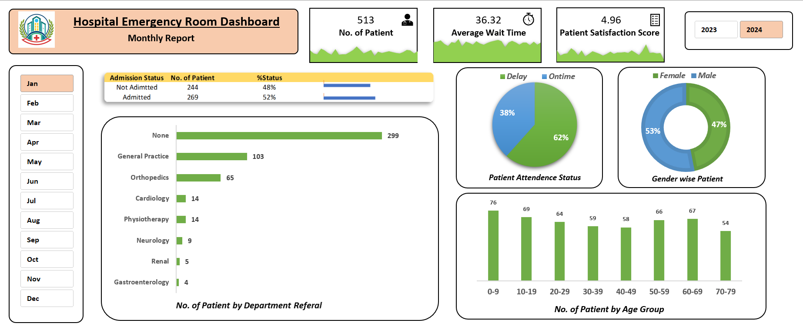

# Hospital Emergency Room Dashboard (Excel)

## Project Overview
This project analyzes Emergency Room (ER) data using an Excel dashboard to identify operational challenges such as patient waiting time, admission rates, and department referrals.

## Tools Used
- Microsoft Excel
- Data Cleaning
- Pivot Tables
- Data Visualization

## Key Metrics
- Total Patients: 513
- Average Wait Time: 36.32 minutes
- Admission Rate: 52%
- Patient Satisfaction Score: 4.96

## Key Insights
- High waiting time in the emergency room
- Large number of patients without department referrals
- Majority of patients experience delayed attendance
- Highest patient visits from the 0–19 age group

## Problems Identified
- ER waiting time inefficiency
- Patient flow management issues
- Referral process gaps

## Solutions Suggested
- Improve triage system
- Implement digital queue management
- Optimize department referral processes
- Better staff allocation during peak hours

## Dashboard Preview

